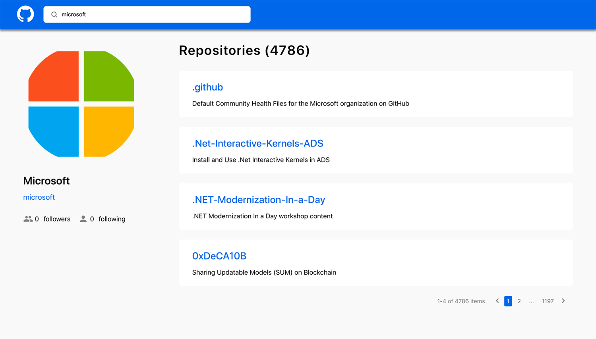

<div id="top"></div>

<!-- PROJECT LOGO -->
<br />
<div align="center">

  

  <h3 align="center">My GitHub App</h3>

  <p align="center">
    Find GitHub users and their repositories.
    <br />
    <br />
</div>

<!-- TABLE OF CONTENTS -->
<details>
  <summary>Table of Contents</summary>
  <ol>
    <li>
      <a href="#about-the-project">About The Project</a>
      <ul>
        <li><a href="#built-with">Built With</a></li>
      </ul>
    </li>
    <li>
      <a href="#getting-started">Getting Started</a>
      <ul>
        <li><a href="#installation">Installation</a></li>
      </ul>
    </li>
    <li><a href="#usage">Usage</a></li>
    <li><a href="#roadmap">Roadmap</a></li>
    <li><a href="#contact">Contact</a></li>
  </ol>
</details>

<!-- ABOUT THE PROJECT -->

## About The Project



This application provides possibility to search for GitHub users and see their data and their repositories list. It is also possible to open user profile or specific repository of user on GitHub.

<p align="right">(<a href="#top">back to top</a>)</p>

### Built With

This application designed using the following technologies:

- [React.js 18.0.0](https://reactjs.org/)
- [Redux Toolkit 1.8.1](https://redux-toolkit.js.org/)
- [TypeScript 4.6.3](https://www.typescriptlang.org/)
- [Sass 7.0.1](https://sass-lang.com/)
- [GitHub REST API](https://docs.github.com/en/rest)

Also additional libraries and tools were used for application development:

- [ESLint 8.14.0](https://eslint.org/)
- [Prettier 2.6.2](https://prettier.io/)
- [Axios 0.26.1](https://www.npmjs.com/package/axios)
- [React Paginate 8.1.3](https://www.npmjs.com/package/react-paginate)
- [Redux DevTools](https://github.com/reduxjs/redux-devtools)

<p align="right">(<a href="#top">back to top</a>)</p>

<!-- GETTING STARTED -->

## Getting Started

To get a local copy up and running follow these simple example steps.

### Installation

1. Clone the repo
   ```sh
   git clone https://github.com/roman-kurashevich/startup-summer-task
   ```
2. After you clone this repo, go to its root directory and install all the dependencies using NPM
   ```sh
   npm install
   ```
3. Once the dependencies are installed, you can start the application
   ```sh
   npm start
   ```
4. You will then be able to access it at localhost:3000

<p align="right">(<a href="#top">back to top</a>)</p>

<!-- USAGE EXAMPLES -->

## Usage

There is a search field on the page for entering username.

If user exists, user page is displayed after entering username and pressing Enter button on keyboard (or clicking on magnifying icon on the left of search field). User page contains user information with list of his repositories.

If user doesn't exist, the page with text "User not found" will be displayed.

If user doesn't have any public repositories, the message "Repository is empty" will be displayed instead of repositories list.

After clicking on username link the GitHub profile is opened in new tab.

After clicking on repository name the GitHub page of this repository is opened in new tab.

There is a pagination in the list of repositories.

The application has responsive design and can be used in browsers on mobile devices.

<br>


<p align="right">(<a href="#top">back to top</a>)</p>

<!-- CONTACT -->

## Contact

Roman Kurashevich - [@my linkedin](https://www.linkedin.com/in/roman-kurashevich-ab3a2b220/) - rkurashevich@gmail.com

Project Link: [https://my-github-app.netlify.app/](https://my-github-app.netlify.app/)

<p align="right">(<a href="#top">back to top</a>)</p>
